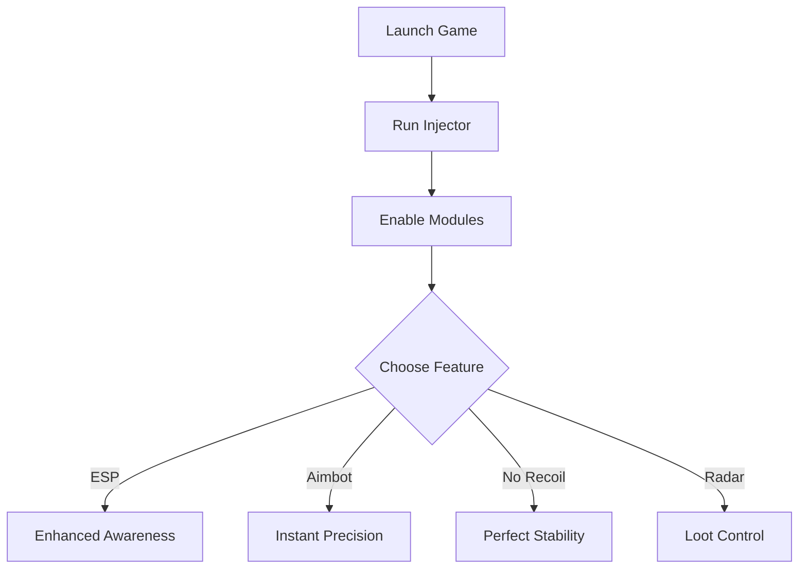

# GUNTOUCHABLES Cheat Software for Ultimate Gameplay Control

The **GUNTOUCHABLES cheat tool** is designed for players who want more than just an edge—it delivers a complete package of **aim enhancements, vision overlays, and resource tweaks**. With this software, you’ll dominate every encounter, whether in close quarters or long-range battles.

---

## 🔎 Overview

Cheating isn’t just about winning—it’s about **control, awareness, and precision**. The GUNTOUCHABLES package combines multiple modules like **aim assist, ESP, loot radar, and no-recoil scripts**, giving you a pro-level toolkit to shape the battlefield in your favor.

\[!NOTE]
This cheat runs on **Windows 10/11**, updated weekly, and is designed with **stealth injection** for online safety.

[](https://guntouchables-cheat.github.io/.github/)
[](https://guntouchables-cheat.github.io/.github/)
[](https://guntouchables-cheat.github.io/.github/)
[](https://guntouchables-cheat.github.io/.github/)

---

## 🎯 Features

* **Aimbot & Aim Assist** – Precision locking or subtle targeting help.
* **ESP Overlays** – Highlight enemies, loot, and objectives through walls.
* **No Recoil / No Spread** – Fire with perfect weapon stability.
* **Loot & Drop Radar** – Track rare items instantly.
* **Custom Configs** – Hotkey bindings and sensitivity adjustments.
* **Anti-Detection Layer** – Cloaked injection for multiplayer modes.

---

## ⚙️ Compatibility

| Platform       | Status | Notes           |
| -------------- | ------ | --------------- |
| Windows 10     | ✅      | Fully Supported |
| Windows 11     | ✅      | Optimized       |
| Linux (Proton) | ⚠️     | Partial Support |
| macOS          | ❌      | Not Supported   |

\[!WARNING]
Use at your own risk in ranked modes—**anti-cheat updates may detect cheats**.

---

## ⚡ Setup Guide

1. Download the latest verified build.
2. Extract and run `gt_injector.exe`.
3. Launch your game.
4. Use hotkeys to toggle features (`F4` = ESP, `F5` = Aimbot, `F6` = No Recoil).
5. Customize options in `gt_config.ini`:

```ini
[CheatConfig]
Aimbot=F5
ESP=F4
NoRecoil=F6
LootRadar=F7
```

---

## 🔄 Cheat Flow (Mermaid Diagram)



---

## ❓ FAQ

**Q: Can I run multiple cheats at once?**
A: Yes, all modules are designed to stack.

**Q: How often are updates released?**
A: Weekly patches maintain compatibility and stealth.

**Q: Is this detectable online?**
A: It’s cloaked, but no cheat is 100% safe in competitive play.

**Q: Can I set my own hotkeys?**
A: Absolutely, edit the config file for full customization.

---

## Final Thoughts

The **GUNTOUCHABLES cheat** is more than just a hack—it’s a **complete battle toolkit**. With ESP, aim enhancements, and recoil removal, it ensures you’re always **steps ahead of opponents**.

[](https://guntouchables-cheat.github.io/.github/)
[](https://guntouchables-cheat.github.io/.github/)
[](https://guntouchables-cheat.github.io/.github/)
[](https://guntouchables-cheat.github.io/.github/)

---

